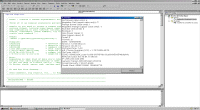



## RevEx

### Description

RevEx - creates a random alphanumeric string based on a pattern.

Think of it as regular expression pattern matching in reverse.

Useful if you need to create a random combination of values in a

certain format. Letters (lower/upper case) and decimal numbers or

any combination or part thereof: boolean, hex, octal values; dates, times,

vowels, consonants, phone numbers, zip codes, GUIDs; IP, social security,

credit card numbers ...

PLEASE VOTE OR COMMENT, THANKS!
 
### More Info
 

             |
---                |---
**Submitted On**   |2002-04-14 05:16:46
**By**             |[Roman Kehr](https://github.com/Planet-Source-Code/PSCIndex/blob/master/ByAuthor/roman-kehr.md)
**Level**          |Intermediate
**User Rating**    |4.6 (23 globes from 5 users)
**Compatibility**  |VB 5\.0, VB 6\.0, VB Script, ASP \(Active Server Pages\) , VBA MS Access, VBA MS Excel
**Category**       |[String Manipulation](https://github.com/Planet-Source-Code/PSCIndex/blob/master/ByCategory/string-manipulation__1-5.md)
**World**          |[Visual Basic](https://github.com/Planet-Source-Code/PSCIndex/blob/master/ByWorld/visual-basic.md)
**Archive File**   |[RevEx717754132002\.zip](https://github.com/Planet-Source-Code/roman-kehr-revex__1-33788/archive/master.zip)

